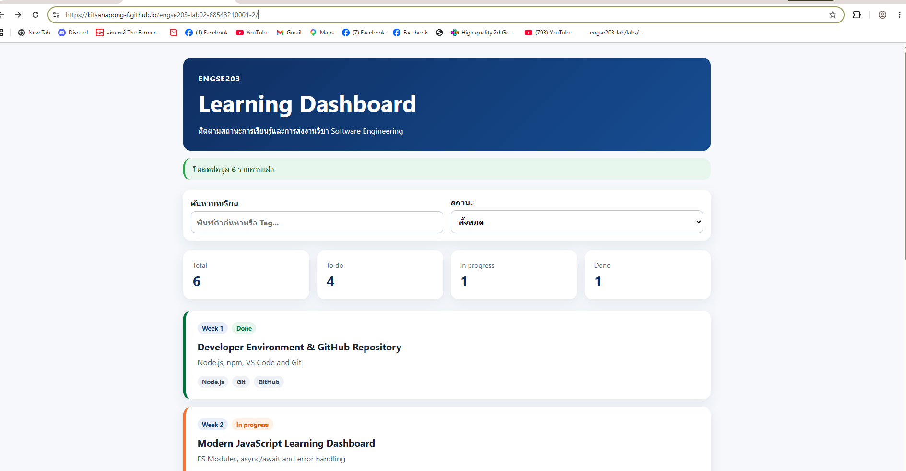
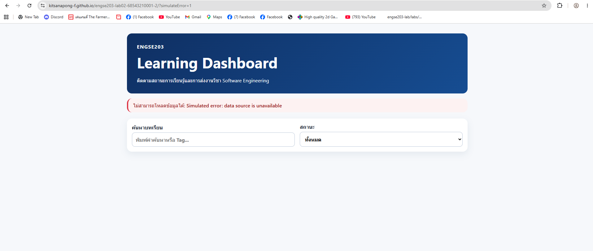

# ENGSE203 LAB 02 — Modern JavaScript Dashboard

## ผู้จัดทำ

- Student ID: `<68543210001-2>`

- Name: `<นาย กฤษณพงศ์ ชัยสุ>`

- Operating system: `<Windows + WSL>`

- GitHub Pages URL: `<https://github.com/Kitsanapong-F/engse203-lab02-68543210001-2>`

---

## วัตถุประสงค์ของงาน

ปรเจกต์นี้เป็นส่วนหนึ่งของ Lab 02 ในรายวิชา ENGSE203 (Modern JavaScript, Modules & Async Data) โดยเป็นการพัฒนา Learning Dashboard ด้วย JavaScript สมัยใหม่ (Vanilla JavaScript / ES Modules) ที่แบ่งการทำงานออกเป็นโมดูลย่อยอย่างน้อย 4 โมดูล เพื่อฝึกการออกแบบโครงสร้างโค้ดที่เป็นระเบียบ (Separation of Concerns) น่ากลับมาใช้ซ้ำได้ (reusable) และดูแลรักษาง่าย (maintainable) Dashboard นี้แสดงผลข้อมูลการเรียนรู้แบบไดนามิกที่โหลดผ่าน Async/Await จากไฟล์ JSON ในรูปแบบ UI ที่รองรับทั้ง สถานะปกติ (Normal State) และ สถานะเมื่อเกิดข้อผิดพลาด (Error State จาก query string ?simulateError=1) พร้อมทั้งมีการตรวจสอบคุณภาพโค้ดด้วยเครื่องมือที่กำหนด (npm run check) และ deploy ขึ้น GitHub Pages เพื่อให้เข้าถึงได้จริงผ่านเบราว์เซอร์

### โครงสร้างโมดูล (Modules)

| NO. | Module     | หน้าที่ความรับผิดชอบ                                                                                                                                                                  |
| :-: | :--------- | :------------------------------------------------------------------------------------------------------------------------------------------------------------------------------------ |
|  1  | `api.js`   | ดึงข้อมูล (data fetching) จาก `data/learning-tasks.json` ผ่าน `fetchLearningTasks()` รองรับการจำลอง error (`simulateError`) ตรวจสอบ HTTP status และรูปแบบข้อมูลที่ได้รับ (validation) |
|  2  | `main.js`  | Entry point ของแอป จัดการ state, event listeners (search/filter), เรียกใช้ฟังก์ชันจากโมดูลอื่นเพื่อโหลดและ render ข้อมูล รวมถึงจัดการ try/catch สำหรับ error handling                 |
|  3  | `ui.js`    | รับผิดชอบการ render UI ทั้งหมด เช่น `renderStats()`, `renderTasks()`, `setMessage()` และป้องกัน XSS ด้วย `escapeHtml()`                                                               |
|  4  | `utils.js` | ฟังก์ชันช่วยเหลือ (utilities) สำหรับกรองข้อมูล (`filterTasks`), คำนวณสถิติ (`getStats`) และแปลง label สถานะ (`getStatusLabel`)                                                        |

---

## วิธีติดตั้งและรันโปรเจกต์

### ข้อกำหนดเบื้องต้น (Prerequisites)

- node -v

- npm -v

### ขั้นตอนกรทำ

```bash

curl -o- https://raw.githubusercontent.com/nvm-sh/nvm/v0.40.5/install.sh | bash


source ~/.zshrc


command -v nvm


nvm install 22

nvm alias default 22

nvm use 2

```

### clone git@github.com:Kitsanapong-F/engse203-lab02-68543210001-2.git

```bas

# 1. Clone repository

git clone git@github.com:Kitsanapong-F/engse203-lab02-68543210001-2.git

cd engse203-lab02-68543210001-2


# 2. ติดตั้ง npm

npm init -y

npm install

```

## โครงสร้างไฟล์

```text

.

engse203-lab02-<student-id>/

├── public/

│   ├── .nojekyll

│   └── data/

│       └── learning-tasks.json

├── scripts/

│   └── check-project.mjs

├── src/

│   ├── api.js

│   ├── main.js

│   ├── style.css

│   ├── ui.js

│   └── utils.js

├── docs/               # สร้างจาก npm run build และต้อง commit

├── .gitignore

├── index.html

├── package.json

├── README.md

└── vite.config.js

```

### คำสั่งที่ใช้งานได้

| คำสั่ง | คำอธิบาย |

|--------|----------|

| `npm install` | ติดตั้ง dependencies ทั้งหมดของโปรเจกต์ |

| `npm run dev` | รันเซิร์ฟเวอร์สำหรับพัฒนา (development server) พร้อม hot reload |

| `npm run check` | ตรวจสอบโค้ด |

| `npm run build` | สร้าง build output สำหรับ production ไปยังโฟลเดอร์ `docs/` |

หลังรัน `npm run dev` ให้เปิดเบราว์เซอร์ไปที่ URL ที่แสดงใน terminal (เช่น `http://localhost:5173`)

---

## GitHub Pages URL

🔗 Dashboard ที่ deploy แล้ว: https://kitsanapong-f.github.io/engse203-lab02-68543210001-2/

---

## ภาพหน้าจอ (Screenshots)

### Normal State



### Error State



---

## ปัญหาที่พบและวิธีแก้ไข

| ปัญหาที่พบ                                             | สาเหตุ                                                                                                                                          | วิธีแก้ไข                                                                                                                                       |
| :----------------------------------------------------- | :---------------------------------------------------------------------------------------------------------------------------------------------- | :---------------------------------------------------------------------------------------------------------------------------------------------- |
| `Homebrew is not writable` / สิทธิ์ในโฟลเดอร์ถูกจำกัด  | โฟลเดอร์ `/opt/homebrew` ถูกล็อกสิทธิ์ (Permission) เอาไว้สำหรับสิทธิ์ Administrator ของห้องแล็บเท่านั้น ทำให้อัปเดตหรือติดตั้งผ่าน brew ไม่ได้ | ปรับเปลี่ยนมาสร้างไฟล์ config `.zshrc` ขึ้นมาใหม่ในสิทธิ์ User ของตัวเองเพื่อรันติดตั้ง NVM และ Node.js แยกต่างหาก หรือใช้ GitHub Codespaces    |
| `git push` โดนปฏิเสธ บล็อกข้อความสีแดง `(fetch first)` | โค้ดบน GitHub มีการแก้ไขหรืออัปเดต (เช่น หน้าไฟล์ README) ที่เครื่องโลคอลในห้องเรียนยังไม่มี ทำให้เวอร์ชันไม่ตรงกัน                             | รันคำสั่ง `git pull origin main` เพื่อดึงซิงค์ข้อมูลจาก GitHub ลงมารวมกับเครื่องปัจจุบันก่อน แล้วจึงจะสั่ง `git push` ได้ตามปกติ                |
| `error path ... Could not read package.json: ENOENT`   | สั่งรันคำสั่ง `npm run dev` ผิดตำแหน่ง (โฟลเดอร์ปัจจุบันที่เปิดใน Terminal ไม่มีไฟล์ package.json ของโปรเจกต์อยู่)                              | ใช้คำสั่ง `ls` เพื่อเช็กรายชื่อไฟล์ และใช้คำสั่ง `cd <ชื่อโฟลเดอร์โปรเจกต์>` ย้าย Terminal เข้าไปในโฟลเดอร์ที่มีไฟล์โปรเจกต์อยู่จริงก่อนสั่งรัน |

> เพิ่ม/ลบแถวได้ตามจำนวนปัญหาที่พบจริงระหว่างการพัฒนา

---

## References & AI Assistance

### References

-[async-await_and_error-handling.md](https://github.com/se-rmutl/engse203-lab/blob/main/labs/week-02-modern-javascript/docs/async-await_and_error-handling.md)

-[destructuring_array_map_filter_reduce.md](https://github.com/se-rmutl/engse203-lab/blob/main/labs/week-02-modern-javascript/docs/destructuring_array_map_filter_reduce.md)

-[functions_and_invocation.md](https://github.com/se-rmutl/engse203-lab/blob/main/labs/week-02-modern-javascript/docs/functions_and_invocation.md)

-[variable_naming.md](https://github.com/se-rmutl/engse203-lab/blob/main/labs/week-02-modern-javascript/docs/variable_naming.md)

### AI Assistance Disclosure
