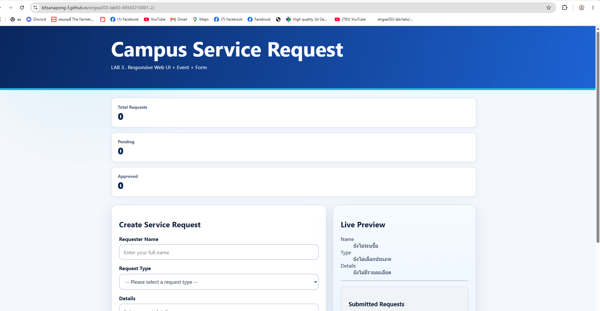
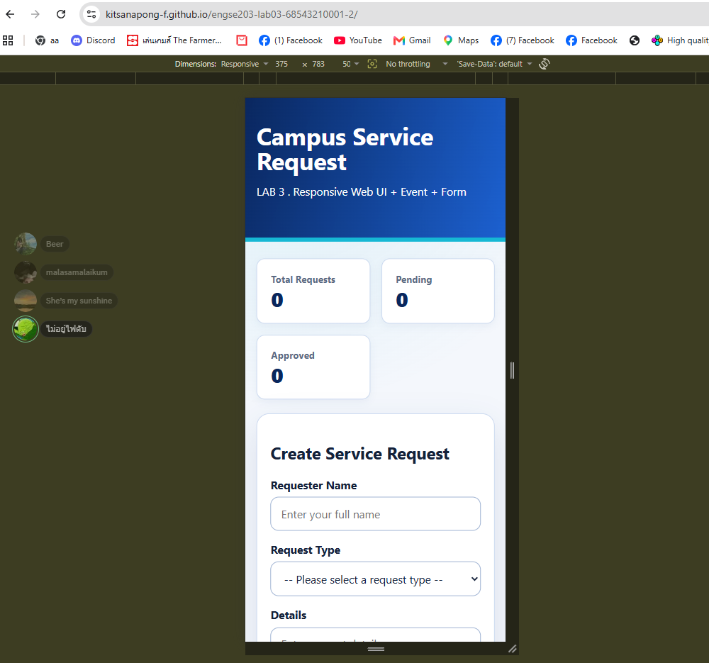
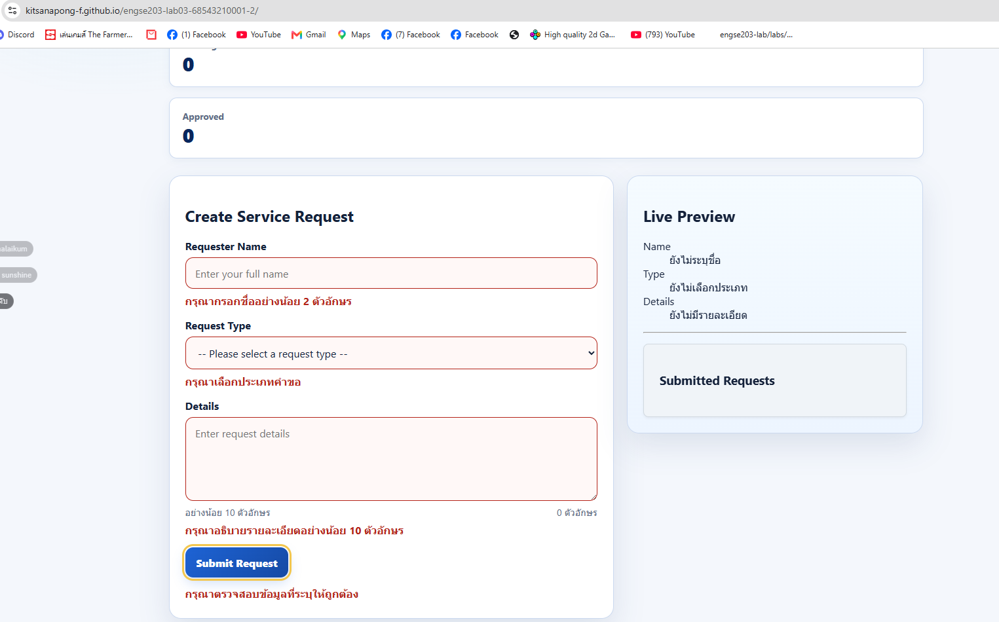
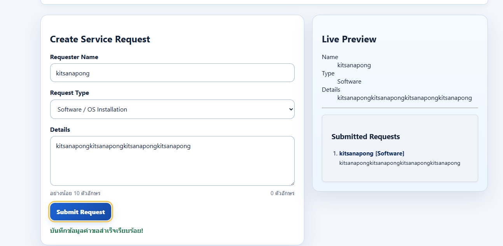
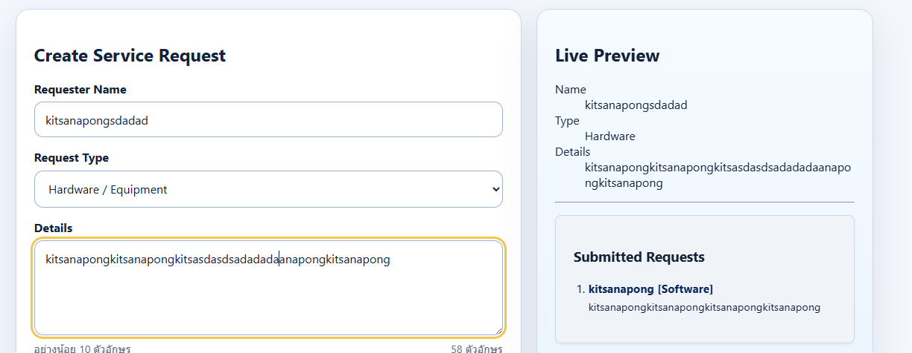
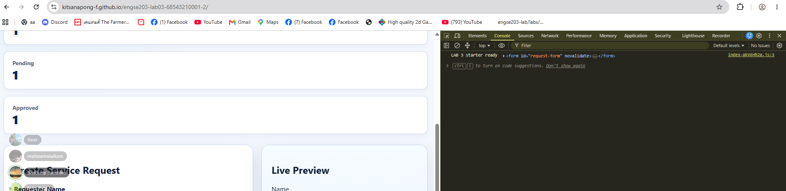

# Week 03 Evidence

รายละเอียดหลักฐานการทดสอบและผลการตรวจสอบการทำงานของระบบ (Manual Test) สำหรับแล็บสัปดาห์ที่ 3

### Desktop Layout
แสดงการจัดวางองค์ประกอบและการตอบสนองของหน้าจอ (Responsive Design) บนขนาดหน้าจอคอมพิวเตอร์ทั่วไป

### Mobile 375px (ไม่มี horizontal scroll)
ทดสอบการแสดงผลบนขนาดหน้าจอสมาร์ตโฟน (ความกว้าง 375px) องค์ประกอบทุกอย่างจัดเรียงลงมาอย่างพอดี และตรวจสอบแล้วว่า**ไม่มีแถบเลื่อนแนวนอน**เกิดขึ้น

### Form Invalid (ไม่ Submit)
การทดสอบกรณีผู้ใช้กรอกข้อมูลไม่ถูกต้อง หรือกรอกข้อมูลไม่ครบตามที่ระบบกำหนด ระบบมีการแจ้งเตือนข้อผิดพลาด (Validation Error) และดักจับ **ไม่ให้มีการส่งข้อมูล (Form Submitted) เกิดขึ้น**

### Form Valid (แสดงผลตามโจทย์)
การทดสอบกรณีผู้ใช้กรอกข้อมูลถูกต้องครบถ้วนทุกช่อง เมื่อกดส่งข้อมูล ระบบประมวลผลและนำข้อมูลไปแสดงผลลัพธ์บนหน้าเว็บได้ถูกต้องตรงตามเงื่อนไขของโจทย์

### Event Interaction ทำงาน
แสดงผลลัพธ์การทำงานของเหตุการณ์ (Event Listeners) ต่าง ๆ ใน JavaScript เช่น การคลิกปุ่ม, การพิมพ์ข้อมูล หรือการเปลี่ยนแปลงสถานะบนหน้าเว็บว่าตอบสนองได้อย่างถูกต้อง

### Console ไม่มี Error
ตรวจสอบผ่านหน้าต่าง Developer Tools ในแท็บ Console แล้ว ระบบรันได้อย่างสมบูรณ์ **ไม่มีตัวหนังสือสีแดง (Error) หรือปัญหาไฟล์ 404 เกิดขึ้น**

