## Test Evidence
| Test ID | Actual Result | Pass/Fail | Evidence/Screenshot |
|---|---|---|---|
| TC-01 Initial | แสดงรายการเริ่มต้นและ summary ถูกต้องครบถ้วน, console ไม่มี error | Pass | 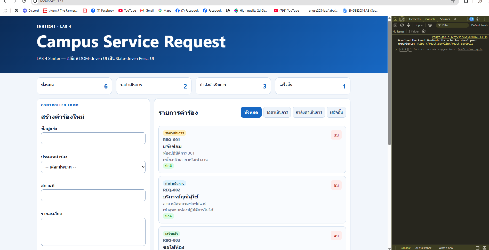 |
| TC-02 Controlled input | ทุก input/select field เปลี่ยนแปลงค่าตาม state ได้อย่างถูกต้องและลื่นไหล | Pass | 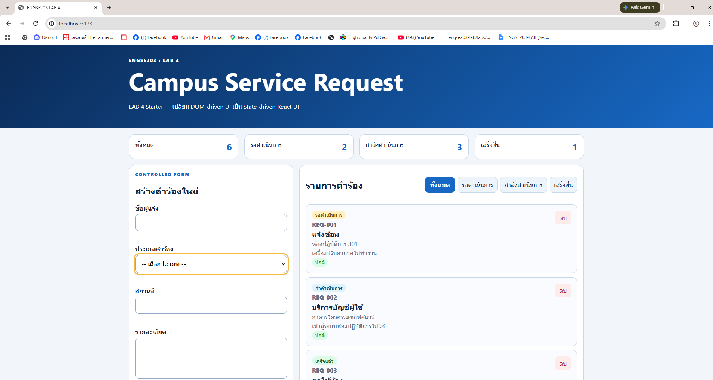 |
| TC-03 Invalid | ระบบบล็อกการส่งข้อมูลเมื่อฟิลด์ไม่ครบ/ไม่ถูกต้อง พร้อมแสดงข้อความแจ้งเตือนใกล้ช่องกรอกข้อมูล | Pass | 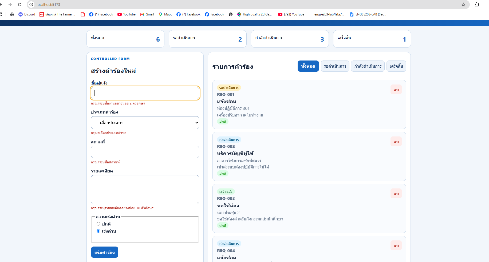 |
| TC-04 Valid add | เพิ่มรายการสถานะ pending สำเร็จ, summary อัปเดตตัวเลขทันที | Pass | 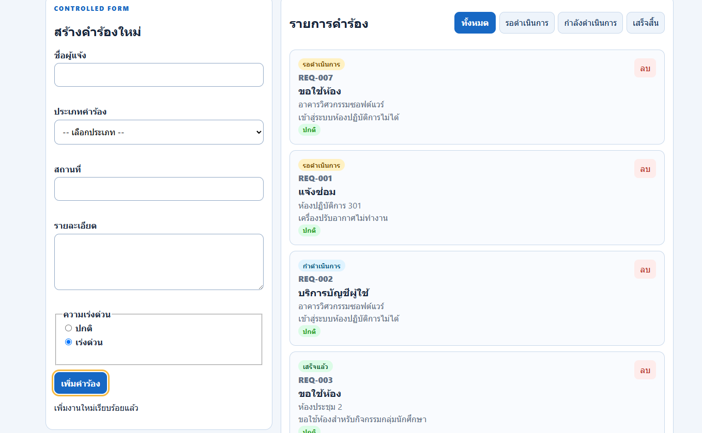 |
| TC-05 Filter | กรองแสดงเฉพาะรายการตามสถานะที่เลือก (เช่น pending, in-progress, completed) ได้อย่างถูกต้อง | Pass |  |
| TC-06 All | ปุ่มแสดงทั้งหมด (All) สามารถแสดงรายการทุกสถานะกลับมาครบถ้วน | Pass | 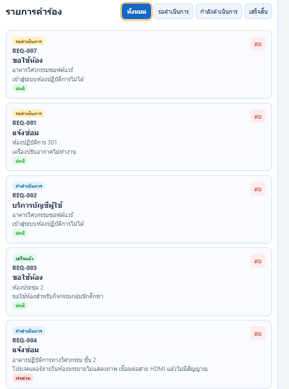 |
| TC-07 Empty | แสดงข้อความแจ้งเตือนเมื่อทำการกรองแล้วไม่พบข้อมูลหรือรายการว่างเปล่า | Pass | 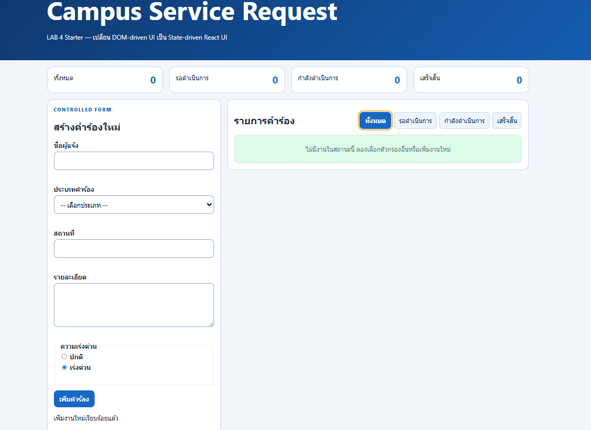 |
| TC-08 Delete | ลบรายการตรงตาม ID ที่ระบุ, รายการใน list และตัวเลขใน summary อัปเดตถูกต้อง | Pass | 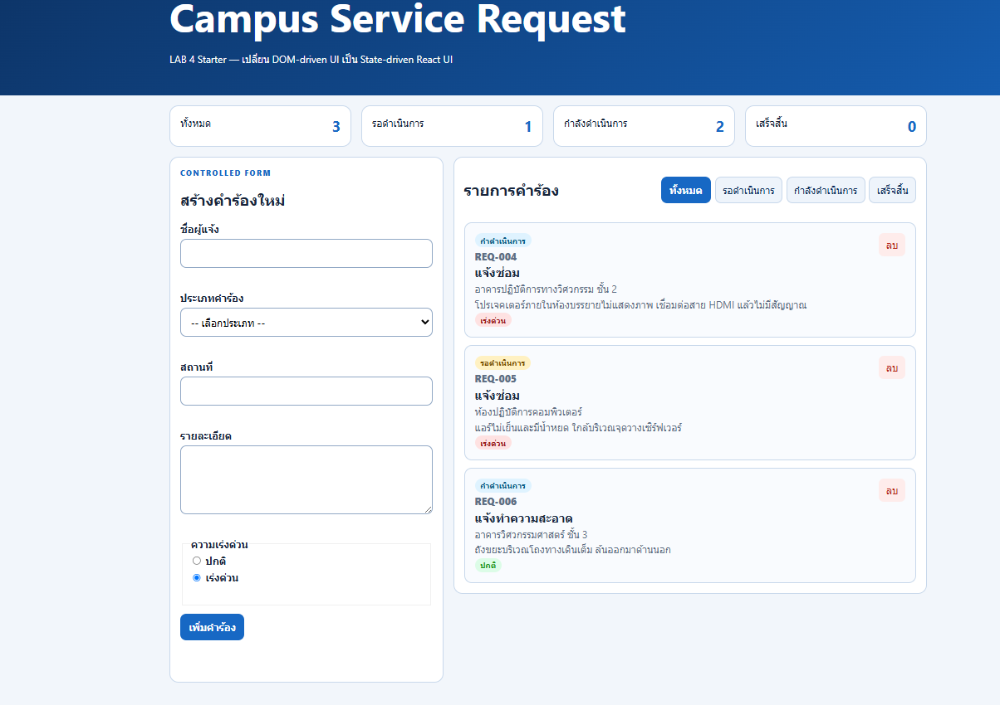 |
| TC-09 Mobile | แสดงผลหน้าจอขนาด 375px ได้สมบูรณ์ ไม่มีปัญหา Horizontal Scroll | Pass | 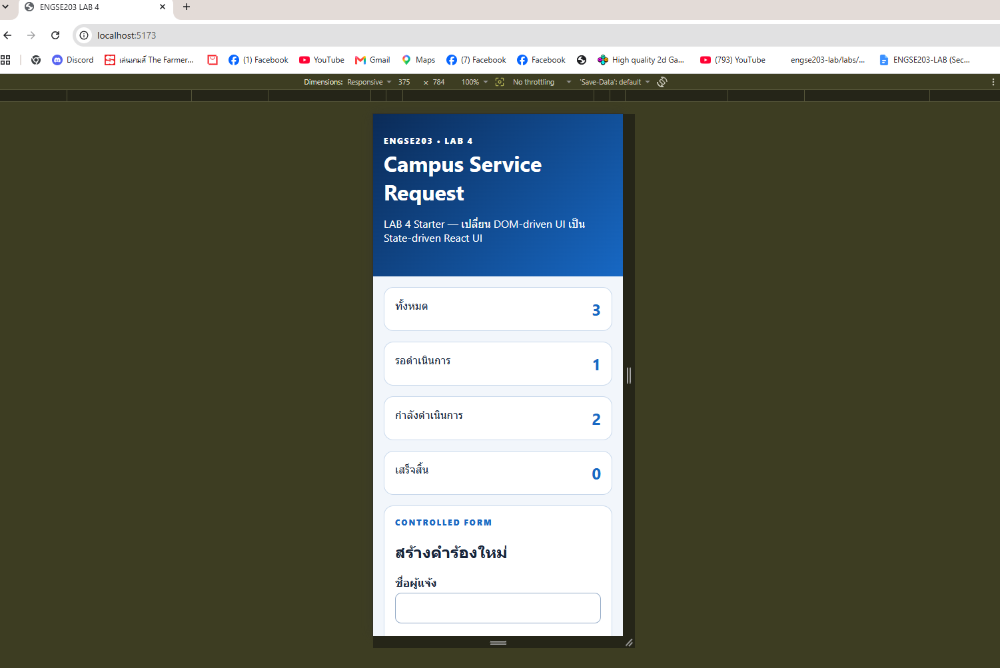 |
| TC-10 Keyboard | รองรับการนำทางด้วยปุ่ม Tab (Keyboard Navigation) มีการแสดง Focus-visible ชัดเจน และเชื่อมโยง label กับ input ถูกต้อง | Pass | 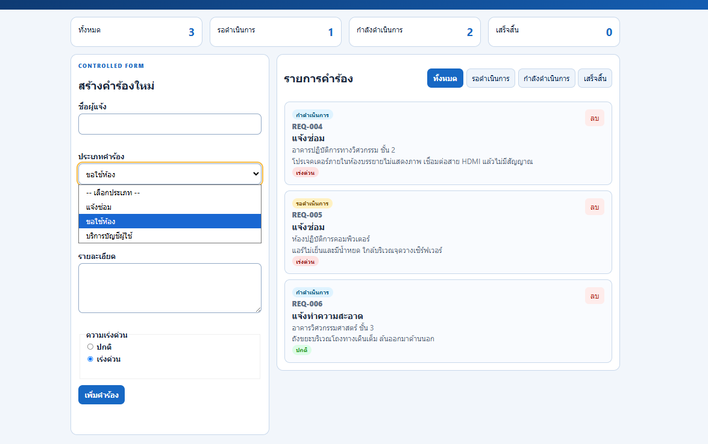 |
| TC-11 Build | รันคำสั่ง npm run build สำเร็จ ไม่มี Error และโฟลเดอร์ dist/ พร้อมใช้งาน | Pass | 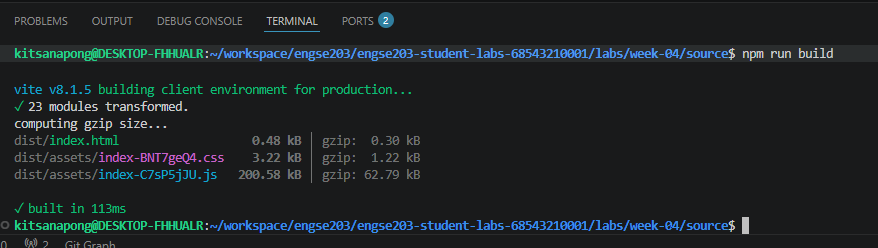 |
| TC-12 Pages | ทดสอบโหลดหน้าเว็บและ Assets สำเร็จครบถ้วน ไม่มีข้อผิดพลาด | Pass | 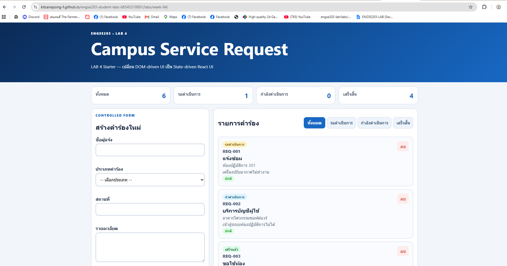 |

## Screenshots

- Desktop: `evidence/desktop.png`
  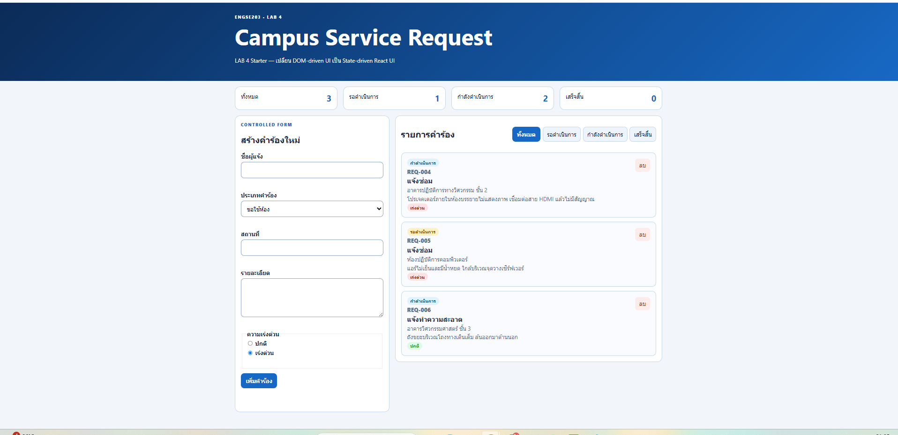

- Mobile 375px: `evidence/mobile-375.png`
  

- Validation/empty state:
  

- Empty state:
  
