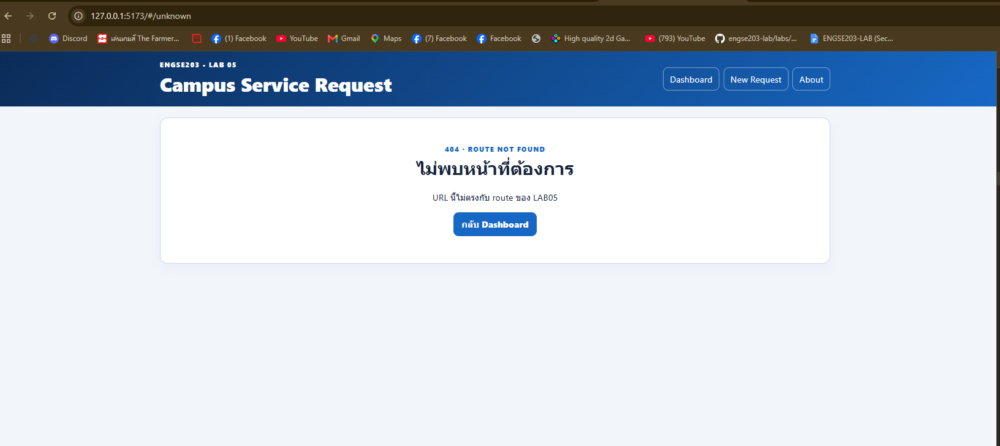

# ENGSE203 LAB05 — Student Test Report

**ชื่อ–รหัส:** TODO  
**OS / Browser / Node:** TODO  
**Branch / Commit:** `lab/week-05` / TODO

กรอก Actual result จากการรันจริง ใช้ `PASS`, `FAIL` หรือ `NOT RUN` และอ้างหลักฐานแบบ relative path
##  5A · CP02 — Routing
| Test ID | Preconditions | procedure summary | Actual result | Status | Evidence / Notes |
|---|---|---|---|---|---|
| TC-L5-01 | เปิด `#/` | แสดงหน้า Route "/" ซึงเป็น Route  DashboardPage| แสดงหน้า DashboardPage พร้อมแสดงข้อมูลคำร้อง |  PASS |  |
| TC-L5-02 | ใช้ navigation 3 รายการ |กดเปลี่ยนไปแต่ละ navigation |แสดงหน้าตามที่ navigation กำหนด Route ไว้| pass |  |
| TC-L5-03 | เปิด/refresh `#/requests/new` | เป็นหน้า #/requests/new แล้วกด refresh | เมื่อกด refresh แล้วไม่แสดงหน้า NotFoundPage |  pass | |
| TC-L5-04 | เปิด `#/requests/REQ-001` | เป็นไปยัง Route ของ คำร้องที่1 | แสดงหน้ารายละเอียดคำร้อง พร้อม ข้อมูล |pass | |
| TC-L5-05 | เปิด `#/requests/REQ-999` | TODO | NOT RUN | |
| TC-L5-06 | เปิด `#/unknown` | TODO | NOT RUN | `images/route-not-found.png` |
| TC-L5-07 | ลบ LAB05 key แล้วเปิด Dashboard | TODO | NOT RUN | |
| TC-L5-08 | สังเกตช่วง latency | TODO | NOT RUN | `images/state-loading.png` |
| TC-L5-09 | เปิด `#/?scenario=error` | TODO | NOT RUN | `images/state-error-retry.png` |
| TC-L5-10 | กด Retry | TODO | NOT RUN | |
| TC-L5-11 | เปิด `#/?scenario=empty` | TODO | NOT RUN | `images/state-empty.png` |
| TC-L5-12 | รัน public checker | TODO | NOT RUN | command summary |
| TC-L5-13 | submit form ผิด validation | TODO | NOT RUN | |
| TC-L5-14 | เพิ่ม valid request แล้ว refresh | TODO | NOT RUN | `images/persistence-add-refresh.png` |
| TC-L5-15 | ทดสอบ filters ทุกค่า | TODO | NOT RUN | |
| TC-L5-16 | ลบ request แล้ว refresh | TODO | NOT RUN | `images/persistence-delete-refresh.png` |
| TC-L5-17 | Reset Demo Data | TODO | NOT RUN | |
| TC-L5-18 | malformed + wrong schema แล้ว reload | TODO | NOT RUN | `images/storage-recovery.png` |
| TC-L5-19 | เทียบ summary กับ data | TODO | NOT RUN | |
| TC-L5-20 | viewport 375px ทุก page | TODO | NOT RUN | `images/responsive-375.png` |
| TC-L5-21 | keyboard only | TODO | NOT RUN | |
| TC-L5-22 | checker/build/preview | TODO | NOT RUN | command summary |
| TC-L5-23 | Pages Incognito + hash refresh | TODO | NOT RUN | `images/pages-incognito.png` + URL |
| TC-L5-24 | merged PR + tag | TODO | NOT RUN | PR URL + commit/tag |

## Rerun log

เก็บร่องรอย FAIL เดิม แล้วเพิ่มบรรทัด rerun แทนการลบประวัติ

| Test ID | เวลา | Fix | Actual result | Status |
|---|---|---|---|---|
| TODO | TODO | TODO | TODO | TODO |
