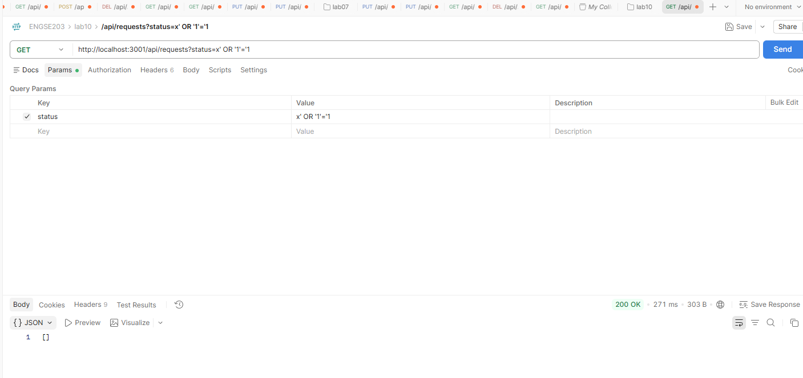
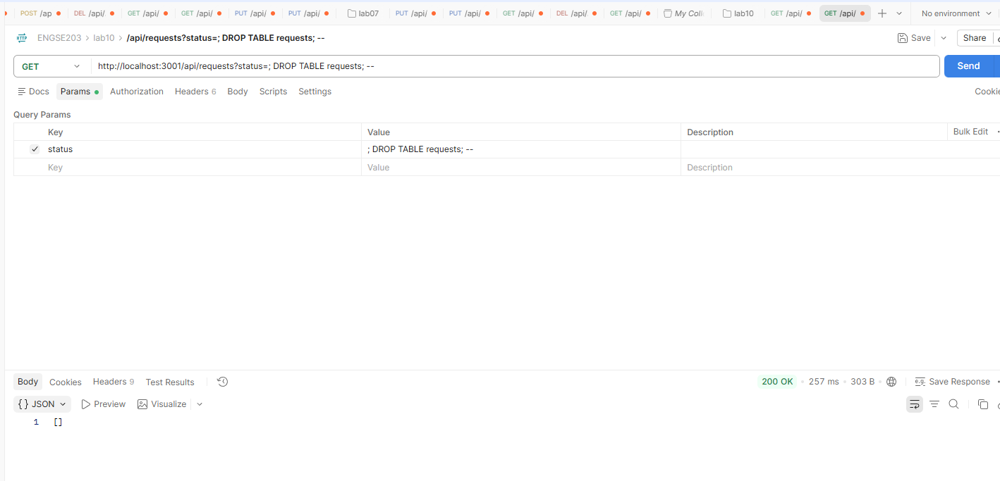
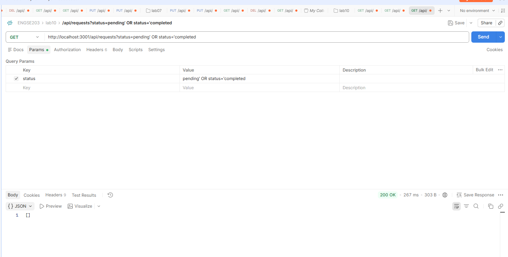
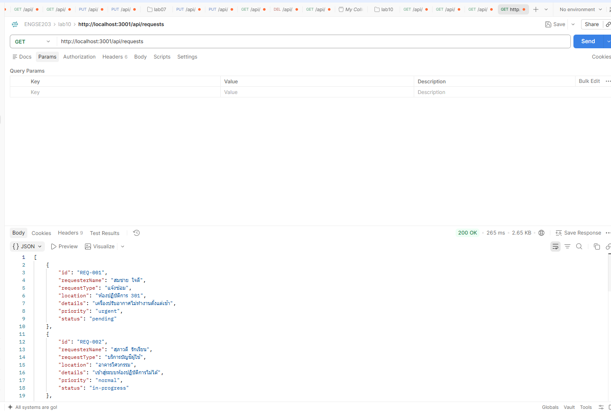

## ผลการทดสอบ SQL Injection

### ๑ เงื่อนไขที่เป็นจริงเสมอ

**ยิง** `GET /api/requests?status=x' OR '1'='1`
**ผลที่ได้** `[]` (0 รายการ) ✓ ถูกป้องกัน
**เพราะ** ใช้ parameterized query – ค่าถูกตีความเป็นข้อความ ไม่ใช่คำสั่ง

---

### ๒ พยายามลบตาราง

**ยิง** `GET /api/requests?status='; DROP TABLE requests; --`
**ผลที่ได้** `[]` (0 รายการ) ✓ ถูกป้องกัน
**เพราะ** ใช้ parameterized query – SQLite มองว่าค้นหา status ชื่อนั้นจริงๆ ไม่รันคำสั่ง DROP TABLE

---

### ๓ ต่อเงื่อนไขเพิ่ม

**ยิง** `GET /api/requests?status=pending' OR status='completed`
**ผลที่ได้** `[]` (0 รายการ) ✓ ถูกป้องกัน
**เพราะ** ค่า Parameterized Bind ป้องกันไม่ให้ตัวแปรหลุดออกไปแปลงเป็นโครงสร้างคำสั่ง SQL เพิ่มเติม

---

### ๔ พิสูจน์ว่าตารางยังอยู่

**ยิง** `GET /api/requests`
**ผลที่ได้** คืนข้อมูลรายการปกติ ไม่ขึ้น error
**เพราะ** คำสั่ง `DROP TABLE` ในข้อ ๒ ไม่ได้ถูกประมวลผล ตารางและข้อมูลจึงยังปลอดภัย

