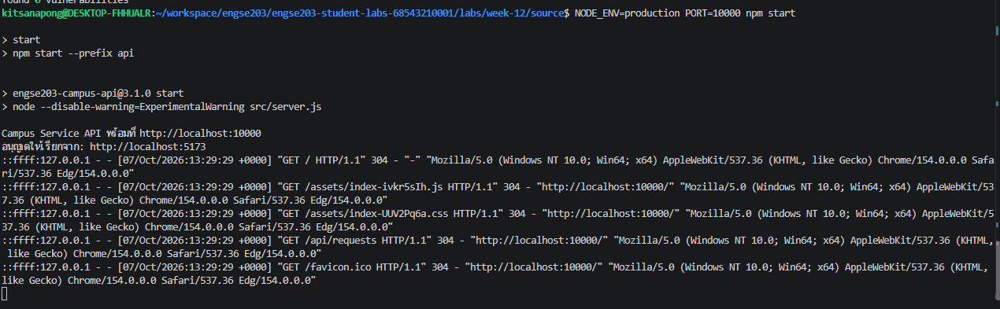
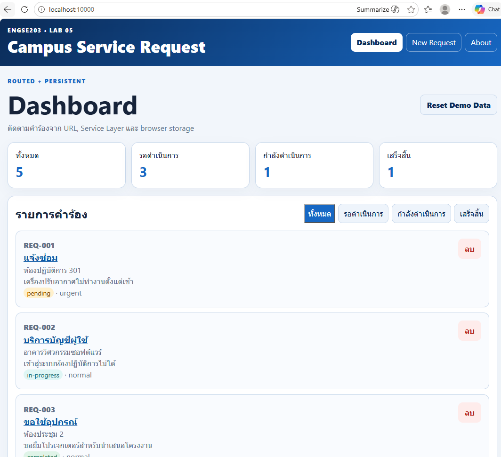
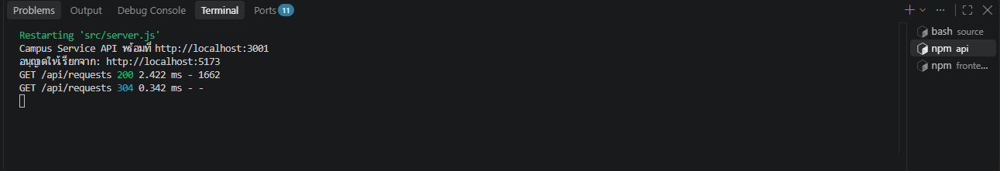
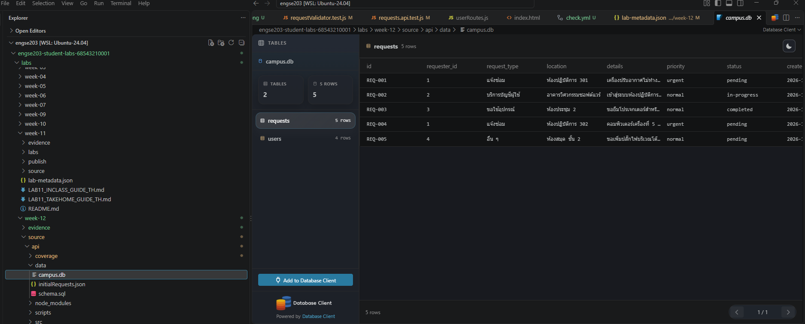
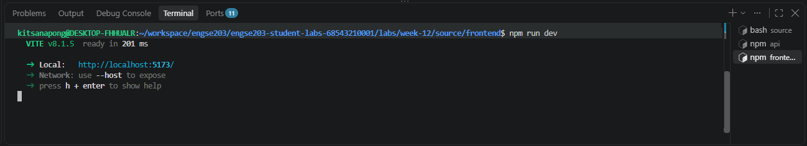

# หลักฐานการสาธิต — Campus Service Full-Stack (A4)

## วิดีโอสาธิต
🔗 ([ใส่ลิงก์วิดีโอ YouTube/Drive/Loom ที่นี่](https://youtu.be/ZrII6UEx8vc))

## สิ่งที่สาธิตในวิดีโอ (ครบวงจร)

- [x] เปิดระบบครบ 3 ชั้น (React + API + DB)
- [x] ดูรายการคำร้อง — ข้อมูลมาจากฐานข้อมูล
- [x] เพิ่มคำร้องใหม่ — เห็นข้อมูลบันทึกจริง
- [x] เปลี่ยนสถานะ · ลบคำร้อง
- [x] `GET /api/health` แสดงสถานะระบบ
- [x] ปิดเซิร์ฟเวอร์แล้วเปิดใหม่ — ข้อมูลยังอยู่
- [x] รัน production build แล้วเปิดจากพอร์ตเดียว

## ภาพหน้าจอ
### Log Production

### Production

### Run API

### Run Database

### Run Frontend

